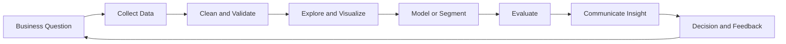

<!-- ============================================================ -->
<!--  GITHUB PROFILE README - MAHEK GHODMARE                       -->
<!--  Repo name must be exactly your username: mahekghodmare       -->
<!--  Search for "EDIT" to find every spot you should customize.   -->
<!-- ============================================================ -->

  

  
  
  

  
  
  

---

## 📑 Table of Contents

- [About Me](#-about-me)
- [Quick Facts](#-quick-facts)
- [What I'm Working On](#-what-im-working-on)
- [Tech Stack](#%EF%B8%8F-tech-stack)
- [What I Do With Data](#-what-i-do-with-data)
- [Featured Projects](#-featured-projects)
- [Experience](#-experience)
- [Research and Writing](#-research-and-writing)
- [Beyond Code](#-beyond-code)
- [My Analytics Workflow](#-my-analytics-workflow)
- [Learning Roadmap](#-learning-roadmap)
- [GitHub Dashboard](#-github-dashboard)
- [Education](#-education)
- [Certifications](#-certifications)
- [Goals](#-goals)
- [Collaboration](#-collaboration)
- [Get in Touch](#-get-in-touch)

---

## 🔍 About Me

Hi, I'm **Mahek** 👋

I'm a Data Science / AIML student at **Symbiosis Institute of Technology (SIT), Nagpur** (2024 batch), and I'm building toward a career as a **Data Analyst** or **AI Business Analyst**.

I enjoy the full journey from a messy spreadsheet to a clear decision:

- 🧹 Cleaning and structuring raw data so it can be trusted
- 📊 Exploring patterns, segments and trends
- 🤖 Applying machine learning where it genuinely adds value
- 🗣️ Explaining findings so that non-technical people can act on them
- 📝 Writing up research in a clear, structured way

I like projects that answer a real question, not just ones that train a model and stop there.

> "Data is only useful when it changes a decision."

---

## ⚡ Quick Facts

| | |
|---|---|
| 🎓 **Studying** | Data Science / AIML at SIT Nagpur |
| 🎯 **Aiming for** | Data Analyst / AI Business Analyst roles |
| 💼 **Internship** | Data Science & Data Analytics at Maincrafts Technology |
| 🔬 **Research** | ECG compression and weather forecast accuracy |
| 🌍 **Based in** | Maharashtra, India |
| 🗣️ **Languages** | English, Hindi, Marathi <!-- EDIT: keep only what is true --> |
| 📫 **Reach me** | [Email](mailto:mahek.ghodmare.batch2024@sitnagpur.siu.edu.in) or [LinkedIn](https://linkedin.com/in/mahekghodmare) |

---

## 🌱 What I'm Working On

- 🔭 Polishing my portfolio notebooks so each one reads like a short case study
- 📄 Writing and refining an IEEE-style research paper on adaptive ECG compression
- 📈 Strengthening my SQL and dashboarding skills for analyst roles
- 🧠 Learning how to connect model outputs to business metrics
- 🔐 Prototyping an idea for stronger phone and app password protection

### 🎯 This Quarter's Focus

- [x] Complete a one-month data science internship
- [x] Publish a customer segmentation and recommendation project
- [ ] Add a live dashboard to my best portfolio project <!-- EDIT: tick when done -->
- [ ] Finish and submit the research paper
- [ ] Earn one recognised analytics certification <!-- EDIT -->

---

## 🛠️ Tech Stack

> Only list what you can discuss comfortably in an interview. <!-- EDIT: delete any badge you have not really used -->

### Languages

  
  

### Data Analysis and Machine Learning

  
  
  
  

### Visualization and BI

  
  
  
  
  
  

### Tools and Workflow

  
  
  
  
  

### Web (for small apps and demos)

  
  
  
  

### Writing and Documentation

  
  
  

---

## 📊 What I Do With Data

| Stage | What it means in practice | Tools I use |
|---|---|---|
| **Collect** | Load datasets from CSV, Excel, databases and APIs | Python, SQL |
| **Clean** | Handle missing values, duplicates, outliers and wrong types | Pandas, NumPy |
| **Explore** | Distributions, correlations, trends and anomalies | Pandas, Seaborn, Matplotlib |
| **Segment** | Group customers or records with RFM and clustering | Scikit-learn |
| **Model** | Build and evaluate classification, regression and recommenders | Scikit-learn |
| **Visualize** | Charts and dashboards that tell a story | Plotly, Power BI, Tableau |
| **Communicate** | Short write-ups with a clear recommendation | Markdown, slides, reports |

### 🧭 Questions I Like Answering

- Which customers are most valuable, and which are about to leave?
- What should we recommend next to this shopper?
- How accurate is a forecast, and which source can we trust more?
- How can we keep a signal intact while shrinking the data?

---

## 🚀 Featured Projects

> Replace every `link` below with the real repository URL. <!-- EDIT -->

<table>
  <tr>
    <td width="50%" valign="top">

### 🛍️ Shopper Spectrum

**Customer segmentation and product recommendation**

Analyses the UCI Online Retail dataset to understand who the customers are and what they are likely to buy next.

- RFM analysis (Recency, Frequency, Monetary)
- Clustering to form customer segments
- Product recommendation based on purchase behaviour
- Clear segment profiles that a marketing team can act on

`Python` `Pandas` `Scikit-learn` `Seaborn`

[📂 View Repository](https://github.com/mahekghodmare/shopper-spectrum) <!-- EDIT: link -->

  </td>
  <td width="50%" valign="top">

### 💓 NEXUS-AIC

**Adaptive ECG compression framework**

An IEEE-style research paper proposing an adaptive compression approach driven by a Unified Priority Score.

- Prioritises clinically important parts of the signal
- Balances compression ratio against signal quality
- Structured as a full research paper with method and evaluation
- Aimed at mobile and low-bandwidth healthcare settings

`Python` `Signal Processing` `Research`

[📂 View Repository](https://github.com/mahekghodmare/nexus-aic) <!-- EDIT: link -->

  </td>
  </tr>
  <tr>
    <td width="50%" valign="top">

### 🌦️ Almanac

**Weather forecast web app and accuracy study**

A weather web app with a state and city selector, which grew into a research question about forecast accuracy across several weather APIs.

- Clean state and city selection interface
- Compares forecasts from multiple API sources
- Measures which source is closest to observed weather
- Basis for a short research paper

`JavaScript` `HTML` `CSS` `APIs` `Python`

[📂 View Repository](https://github.com/mahekghodmare/almanac) <!-- EDIT: link -->

  </td>
  <td width="50%" valign="top">

### 🔐 Phone Password Protection Idea

**A stronger personal lock for phones and apps**

A project idea born from a simple problem: the current phone password can be bypassed too easily.

- Extra protection layer for sensitive apps
- Focus on practical usability, not only security theory
- Currently at the design and planning stage

`Concept` `Security` `Design`

[📂 View Repository](https://github.com/mahekghodmare) <!-- EDIT: link once it exists -->

  </td>
  </tr>
</table>

---

### 🛍️ Shopper Spectrum in Detail

<b>Click to expand the full project breakdown</b>

#### Problem

An online retailer has thousands of customers and a long product catalogue, but treats everyone the same. Marketing spend is spread thin and recommendations are generic.

#### Approach

1. **Data cleaning**
   - Removed cancelled invoices and rows with missing customer IDs
   - Handled negative quantities and zero prices
   - Created a total spend column per transaction
2. **RFM feature engineering**
   - Recency: days since the last purchase
   - Frequency: number of distinct purchases
   - Monetary: total money spent
3. **Segmentation**
   - Scaled the RFM features
   - Applied clustering and chose the number of clusters with evidence
   - Named each segment in plain business language
4. **Recommendation**
   - Built a product similarity approach from purchase history
   - Returned top related products for a chosen item
5. **Communication**
   - Summarised each segment with size, behaviour and a suggested action

#### Results

| Metric | Value |
|---|---|
| Customers analysed | `EDIT` |
| Segments found | `EDIT` |
| Largest segment share | `EDIT` |
| Recommendation approach | `EDIT` |

#### What I Learned

- Good cleaning decisions change the final segments more than the choice of algorithm
- Segment names matter, because stakeholders remember names and not cluster numbers
- A simple, explainable approach often beats a complicated one in a business setting

### 💓 NEXUS-AIC in Detail

<b>Click to expand the full project breakdown</b>

#### Problem

ECG signals are large. Sending them from wearable and mobile devices costs bandwidth and battery, but careless compression can destroy the parts a doctor needs.

#### Idea

Instead of compressing every part of the signal equally, NEXUS-AIC scores each segment with a **Unified Priority Score** and compresses less important regions more aggressively while protecting the clinically important ones.

#### Paper Structure

1. Abstract and keywords
2. Introduction and motivation
3. Related work
4. Proposed framework
5. Unified Priority Score
6. Experiments and evaluation
7. Results and discussion
8. Conclusion and future work
9. References

#### Evaluation Ideas

| Measure | Why it matters |
|---|---|
| Compression ratio | How much smaller the data becomes |
| Reconstruction error | How close the recovered signal is |
| Clinical feature preservation | Whether key waveform features survive |
| Processing time | Whether it suits mobile devices |

#### Status

- [x] Framework defined
- [x] Paper drafted section by section
- [ ] Final experiments and figures <!-- EDIT -->
- [ ] Submission <!-- EDIT -->

### 🌦️ Almanac in Detail

<b>Click to expand the full project breakdown</b>

#### Problem

Different weather APIs often give different forecasts for the same place and time. It is not obvious which one to trust.

#### Approach

- Built a simple interface where the user picks a state and then a city
- Pulled forecasts for the selected city
- Planned a comparison of several API sources against observed values
- Turned the comparison into a research question

#### Research Question

> Which weather API gives the most accurate short-term forecast for cities in India, and how does accuracy change with lead time?

#### Planned Metrics

- Mean absolute error for temperature
- Hit rate for rain or no rain
- Error growth as the forecast horizon increases

---

## 💼 Experience

### 🏢 Data Science & Data Analytics Intern

**Maincrafts Technology** &nbsp;|&nbsp; One-month internship

- Worked on data science and data analytics tasks in a professional setting
- Practised cleaning, exploring and visualizing real data <!-- EDIT: make these bullets specific -->
- Documented the work in a formal internship report for my institute <!-- EDIT -->
- Learned how deadlines and stakeholder expectations shape analysis

<b>Make this section stronger</b>

Replace the general bullets above with specific, measurable ones, for example:

- "Cleaned a dataset of N rows and reduced missing values from X% to Y%"
- "Built a dashboard that tracked N metrics for the team"
- "Automated a manual report with Python, saving about N hours a week"

Recruiters remember numbers.

---

## 🔬 Research and Writing

| Work | Topic | Status |
|---|---|---|
| **NEXUS-AIC** | Adaptive ECG compression using a Unified Priority Score | In progress |
| **Weather API accuracy study** | Comparing forecast sources for Indian cities | Planned |
| **Keynote session report** | AI in Medical Imaging and Mobile Healthcare, from an IEEE ICSIT 2026 keynote by Prof. Halgamuge | Written |
| **Internship report** | Data science and analytics internship at Maincrafts Technology | Written |

### ✍️ Why I Write

Writing forces me to understand a method well enough to explain it. It also makes my projects easier for others to evaluate.

---

## 🎨 Beyond Code

I like building things outside notebooks too, because analytics skills transfer directly to business.

### 🃏 CALYVRA

A perfume brand concept built around small 10ml "Pocket Card" scents, with a poker and card-game theme. I work on brand strategy, positioning and social media content such as Instagram launch ideas and reels.

### 🥤 FIZZKEY

A food and beverage startup concept around premium drink transformation and effervescent products, with a six-month launch roadmap.

> These ventures give me practice with customer thinking, pricing, branding and launch planning, all of which make me a better business-minded analyst.

---

## 🔄 My Analytics Workflow

### 📏 Principles I Follow

1. **Start with the question**, not the algorithm
2. **Trust nothing until validated**, including my own cleaning steps
3. **Prefer simple and explainable** over complicated and opaque
4. **Show the evidence**, because a chart beats a claim
5. **End with an action**, not just a number

---

## 🧭 Learning Roadmap

### ✅ Done

- [x] Python fundamentals
- [x] Pandas and NumPy for data wrangling
- [x] Exploratory data analysis
- [x] Clustering and RFM segmentation
- [x] Writing research in IEEE format

### 🔄 In Progress

- [ ] Advanced SQL (joins, window functions, CTEs)
- [ ] Dashboarding in Power BI or Tableau
- [ ] Statistics for decision making (hypothesis tests, confidence intervals)

### 🔜 Next

- [ ] A/B testing and experiment design
- [ ] Time series forecasting
- [ ] Basic cloud data tools
- [ ] A capstone project with a live dashboard

### 📚 Skill Levels

| Skill | Level |
|---|---|
| Python |  |
| Pandas and NumPy |  |
| Data Visualization |  |
| SQL |  |
| Machine Learning |  |
| Statistics |  |
| Dashboards (BI) |  |

<!-- EDIT: adjust the numbers honestly -->

---

## 📈 GitHub Dashboard

  
  

  

  

### 🏆 Trophies

  

### 🐍 Contribution Snake

<!-- Requires the snake.yml workflow in .github/workflows/ and one manual run -->
<picture>
  <source media="(prefers-color-scheme: dark)" srcset="https://raw.githubusercontent.com/mahekghodmare/mahekghodmare/output/github-snake-dark.svg" />
  
</picture>

---

## 🎓 Education

| | |
|---|---|
| **Institute** | Symbiosis Institute of Technology (SIT), Nagpur |
| **Program** | Data Science / AIML related program |
| **Batch** | 2024 |
| **Focus areas** | Data analysis, machine learning, research writing |

### 📚 Relevant Coursework <!-- EDIT: replace with your real subjects -->

- Programming and Data Structures
- Statistics and Probability
- Machine Learning
- Database Management Systems
- Data Visualization

---

## 📜 Certifications

| Certification | Issuer | Year | Link |
|---|---|---|---|
| Add your first certificate here | Issuer | 2026 | [Verify](#) |
| Add your second certificate here | Issuer | 2026 | [Verify](#) |

<!-- EDIT: delete this table if you have none yet. An empty section looks worse than no section. -->

---

## 🎯 Goals

### Short Term (next 6 months)

- Land a data analyst or business analyst internship
- Publish at least three polished case-study projects
- Submit my first research paper

### Medium Term (1 to 2 years)

- Work in an analyst role where I can see my insights change decisions
- Build real depth in SQL, experimentation and dashboarding
- Contribute to an open-source data project

### Long Term

- Grow into an **AI Business Analyst** who connects machine learning to business outcomes
- Keep writing and sharing what I learn

---

## 🤝 Collaboration

### I'm happy to help with

- Data cleaning and exploratory analysis
- Customer segmentation and basic recommenders
- Turning a messy question into an analysis plan
- Structuring a research paper or technical report

### I'm looking for

- Analyst internships and entry-level opportunities
- Study partners for SQL, statistics and machine learning
- Feedback on my projects and write-ups

### How to reach out

1. Open an issue or discussion on any of my repositories
2. Send me a message on LinkedIn
3. Email me with a short note on what you have in mind

---

## 📫 Get in Touch

  
  
  

| Channel | Best for |
|---|---|
| 📧 Email | Opportunities, formal queries, collaborations |
| 💼 LinkedIn | Networking and professional updates |
| 🐙 GitHub | Code questions and project feedback |

---

## 💬 Fun Facts

- 🧮 I enjoy finding the story hiding inside a spreadsheet
- 🃏 I like designing brand ideas as much as designing models
- 📝 I write research reports for fun, which is unusual but true
- ☕ I do my best thinking with a notebook open and a deadline close

---

  <i>"In God we trust. All others must bring data."</i>

  ⭐ If you found something useful here, a star on my repositories is always appreciated. ⭐

<!-- ============================================================ -->
<!--  CHECKLIST BEFORE PUBLISHING                                  -->
<!--  1. Confirm your GitHub username is mahekghodmare             -->
<!--  2. Confirm your LinkedIn URL                                 -->
<!--  3. Replace every EDIT marker and every placeholder link      -->
<!--  4. Delete badges for tools you have not actually used        -->
<!--  5. Fill the EDIT results with real numbers                   -->
<!--  6. Remove sections you cannot back up yet                    -->
<!-- ============================================================ -->
